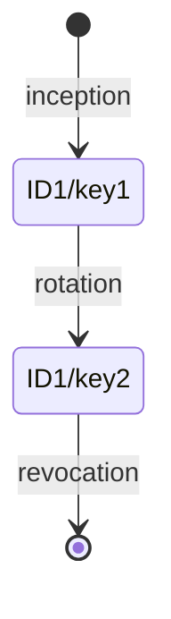
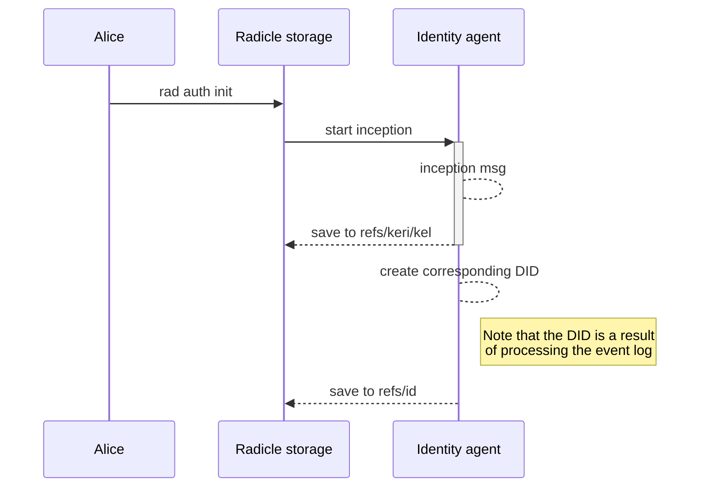
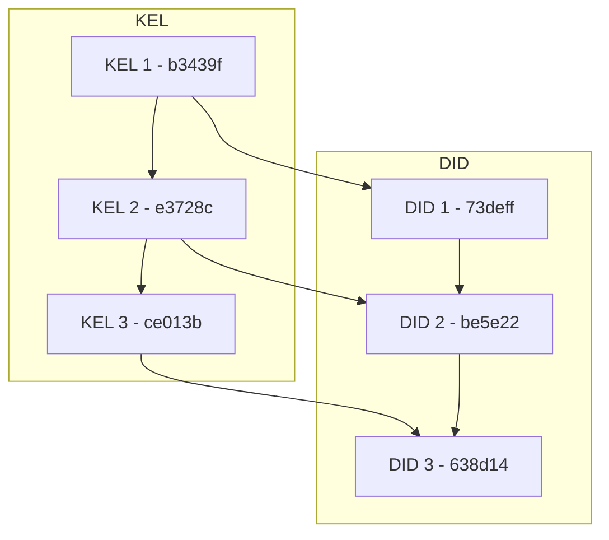
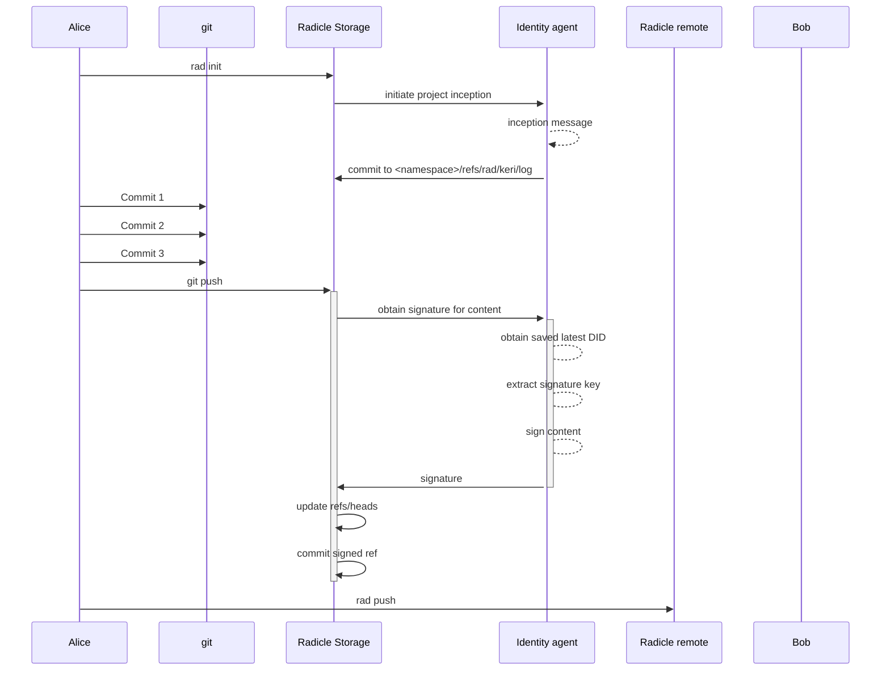
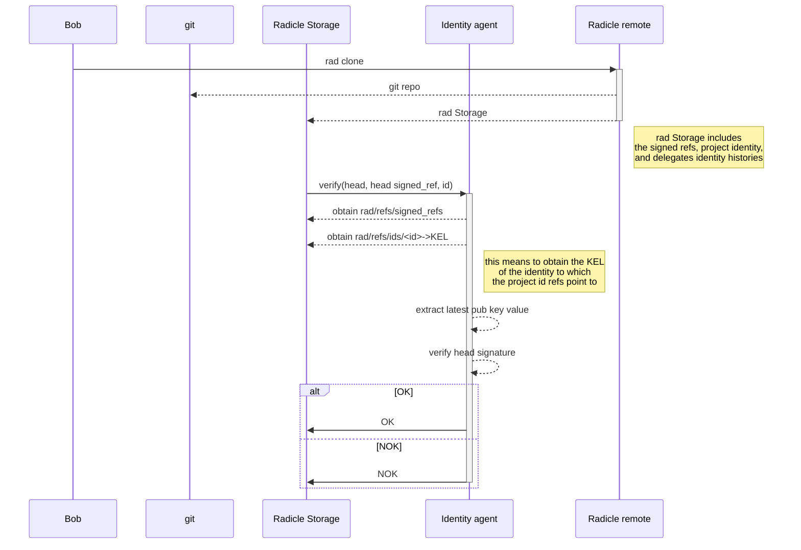

# Using KERI in radicle

In this document we will go over what KERI is, and how it can be used to manage identity in the Radicle ecosystem.

We start with a description of what KERI is and a description of its core concepts, and then move on to specific cases of identity management to see how it would work for Radicle.

We also take a look at the current implementations and what we would need to change to use them in Radicle.

## KERI - Key Event Receipt Infrastructure

[KERI (Key Event Receipt Infrastructure)](https://github.com/decentralized-identity/keri) is a decentralized identity methodology based on the passing of messages to resolve an identity.

While there is a [did:keri](https://weboftrust.github.io/did-keri/) specification, it is not necessary to use this DID method to use the KERI methodology. All we need is:
* A way to pass messages and keep them in a hash-chained append-only log: in our case, these can be commits to a specific namespace
* A way to process these logs to assert the validity of an identifier: this would be done in the `radicle` libraries

### KERI Core concepts

* **Key Event**: atomic transaction over the Key State of an Identifier (e.g. update keys, inception of an identity)
* **Key State**: current values for *keys*, *witnesses*, and *thresholds* for an identifier - we derive the DID from the Key State (i.e., the DID should tell us what's the latest valid state of the identity)
* **Key Event Log**: a hash-chained data structure which contains *Key Events* and from which the *Key State* is derived
* **Key Event Receipt Log**: an append-only log with the receipts to *Key Events* issued by *witnesses*
* **Witness**: a replica which distributes *Key Events* to help with fault tolerance - a witness simply signs events with its own key, hence we can use witnesses to define the *Radicle delegates* (as opposed to *Keri delegates*, see below)
* **Delegates**: entities (other identifiers) that can incept or rotate keys, establishing a hierarchy of identifiers

On top of this there are *transferable* and *non-transferable* identifiers. We will only consider *transferable* identifiers, since those are the ones for which keys can be rotated.

### KERI example

This is a toy example of how KERI would work to incept, modify, and revoke an identifier, outside the Radicle ecosystem:



Here the boxes represent Key States, and the arrows represent Key Events.

These key events and states look like this:

`inception`:
```
{
    "v": "KERI10JSON0000ed_",
    "i": "DHoqdD_OjU7a4TJj85FZF3sFsqwvkJdO_Cyo05aCXuyE",
    "s": "0",
    "t": "icp",
    "kt": "1",
    "k": [
        "DHoqdD_OjU7a4TJj85FZF3sFsqwvkJdO_Cyo05aCXuyE"
    ],
    "n": "ER1d4czHSjWAZw6LGsTlrPJKueRHCAWIUkhdSeoY-sOY",
    "bt": "0",
    "b": [],
    "c": [],
    "a": []
}
```

`rotation`:
```
{
    "v": "KERI10JSON000122_",
    "i": "DHoqdD_OjU7a4TJj85FZF3sFsqwvkJdO_Cyo05aCXuyE",
    "s": "1",
    "t": "rot",
    "p": "EHS-oD_sC0q-zHUkHNFA4XrSyskyX4ivKDC6suHB1cgE",
    "kt": "1",
    "k": [
        "DQpEvB6ylwShkIZtsjgPRb3-fcT6QCNxXwSDTSVxr_7k"
    ],
    "n": "EaQSjEqCJXKs4Vmq-1ee5iKzIg_0Bd9H67zDPxHtyZoU",
    "bt": "0",
    "br": [],
    "ba": [],
    "a": []
}
```

`revocation`:
```
{
    "v": "KERI10JSON0000f6_",
    "i": "DHoqdD_OjU7a4TJj85FZF3sFsqwvkJdO_Cyo05aCXuyE",
    "s": "1",
    "t": "rot",
    "p": "EgxzW8KrOcapWR8PTc-mwr1z9N29sT3Iw8BIYUGRVV50",
    "kt": "1",
    "k": [
        "DtpEHxD7nR6UtV6DuCdnKhKPE7ZUJ8QcOroEuGWSLbGw"
    ],
    "n": "", # Note the empty "next" key
    "bt": "0",
    "br": [],
    "ba": [],
    "a": []
}
```

`ID1/key1`:
```
DHoqdD_OjU7a4TJj85FZF3sFsqwvkJdO_Cyo05aCXuyE
```

`ID1/key2`:
```
DQpEvB6ylwShkIZtsjgPRb3-fcT6QCNxXwSDTSVxr_7k
```

## KERI in Radicle for Person identities

Personal identities are simpler to define first. We will delve into Project identities later.

### Features of the Radicle Person identity

Our resulting Person identity must:

1. Be linked to an individual
2. Allow for multiple signing keys to be used by the individual's devices
3. Allow rotation of keys

To satisfy these, we will be creating a *Multi-sig self-addressing* identity.

TODO: Expand on what this means or link to an explanation.

### Creation of the identity

Let's say we are running `rad auth init`. What steps need to happen to have a KERI identifier?

1. Inception:
    a. Gather all initial keys
    b. Generate `inception` event with multiple keys
2. Commit `inception` event in `~/.rad/storage/<did:keri:hash>/refs/keri/kel/`
3. Commit the resulting DID in `~/.rad/storage/<did:keri:hash>/refs/keri/id`

`~/.rad/storage` is the directory where git refs are saved for radicle internal elements, e.g. identities, remotes namespaces, etc. This means that this repository is not accessible via the usual `git` interface. Let's keep this in mind in the next section.

The process above can be illustrated with a sequence diagram:



The `inception` event would look like this:
```
inception event
```

and the resulting DID:

```
DID
```

### Inception from multiple devices

A more convenient way to initialize our identity with multiple keys (e.g. for multiple devices), is to initialize the identity with one key and then add more. However, we cannot directly access the identity messages stored in our local identity repository.

This is important because it is also true for **other** people trying to verify our identity. However, for this latter case, we can use the project repository. We will circle back to this later.

For the case that we are trying to solve, we would need some `local-identity-server` that would serve our `~/.rad/<did:keri:hash>/` so we can modify that from other devices.

The flow would then look like:

1. Inception:
    a. Get local key
    b. Generate `inception` event with local key
2. Commit `inception` event in `~/.rad/<did:keri:hash>/kel/`
3. Commit the resulting DID in `~/.rad/<did:keri:hash>/id`
4. Obtain `~/.rad/<did:keri:hash>/` through the `local-identity-server`
5. Generate a `key rotation` message, adding our new key for the current device
6. Commit the `key rotation` message to `~/.rad/<did:keri:hash>/kel`
7. Commit the resulting DID in `~/.rad/<did:keri:hash>/id`

Repeat 4-7 for each device.

The `key rotation` event would look like this:
```
rotation event
```

and the resulting DID:

```
DID
```

For the first version, we can focus on the simpler case where we have all keys available.

### Key rotation

Key rotation will look very similar to inception with multiple devices. We will focus here on rotating the keys on one device. Generalizing to multiple devices will be treated in a future version (it basically implies using the same mechanism as in mutliple-device inception to propagate the KEL).

Rotating keys is straightforward in KERI:
1. Generate `key rotation` event
2. Commit the `key rotation` message to `~/.rad/<did:keri:hash>/kel`
3. Commit the resulting DID in `~/.rad/<did:keri:hash>/id`

### Using the keri identities in projects

Each project has its own namespace where its refs are kept, e.g.:

```
refs/namespaces
                abcdef123456/
                            refs/
                                rad/
                                    id
                                    self
                                    signed_refs
```

We will see in the section about project identities that we can add the resulting DID committed under `~/.rad/<did:keri:hash>/id` to the delegates of the project, expressed in the `refs/rad/id` ref.

## KERI in Radicle Project identities

For a project identity, we are mainly concerned with:
* Ability to have delegates
* Ability to specify a quorum of delegates to change the repository

To do this, we can create a *Delegated Self-addressing* identity.

### Creating the project

Let's say we run `rad init`. What needs to happen? First of all, we need to be authenticated with the identity we created in the previous section so `rad` can access it. Then, similar steps to a Person identity are followed:

1. Generate an inception event:
    a. The user that is authenticated is the first delegate
    b. One witness: the same authenticated user
    c. Quorum is 1 (there is only 1 witness)
2. Commit `inception` event to `~/.rad/refs/namespaces/<project_hash>/refs/rad/kel`

In this case we don't need to commit the DID because we won't really use if for anything yet.

The inception message looks like:

```
inception for project
```

We can see that there is a `di` field: this is the identifier of the delegate (or in other words, the identity that is issuing the delegated message).

### Adding delegates

To add delegates, we can add *witnesses* to the project identity. After we add witnesses, the *quorum* parameter of the events starts making sense: *how many witnesses must sign the event for it to be valid?*.

Adding a witness is an *Interaction* event, in which we use parameters `wa`, `wr` to add and remove witnesses respectively, and parameter `wt` to change the quorum.

So the steps would be:
1. The main delegate issues a `delegated interaction event`, manipulating the witness fields
2. Commit the event to `~/.rad/refs/namespaces/<project_hash>/refs/rad/kel`

The resulting DID (or *Key State*  representation) would look like:

```
Multiple witness DID
```

### Verifying with multiple delegates (witnesses)

There are two high-level elements we need to verify when downloading a repository:
* Identities of the delegates
* The content of the repository (i.e. are the commits signed)

#### Verifying the delegates identity

What we need to do is *verify that we have a valid Key State for the project identity*, or in other words walk the *Key Event Log*. KERI does this for us and can tell us whether the KEL is valid and what the latest Key State is.

We cannot really verify the delegates identities without additional information: the only thing we can know is that the project creator appointed them as witnesses, and that the creator did create this repository. What this means for each project is external to Radicle and is left to the project maintainers.

#### Verifying commits

To verify a commit, we need to check whether the applicable witnesses quorum has signed that specific contribution (the associated signed ref). This gets tricky, because keys might change over time. One way to do this is  to "unwind" the KEL from the inception event and verify all the commits starting from the first one (instead of from HEAD).

There is no API for this in the current KERI implementations, so we will need to contribute this API ourselves.

Since this is quite dependent on the actual storage used for the commit signed refs and the identities, we will discuss it in the next section, under *Signed refs*.

# KERI and Git

## Storing the Event log

The first question that pops to mind is how to store the KERI Event Log (KEL). For each event, we need to store the actual event and its signature. KERI does not specify how to append the signature.

We can also store the resulting Key State as a DID for ease of use by the rest of the application.

### Location

In the context of Radicle, we can use the following routes (as mentioned in previous sections):

* KEL: `$storage/namespaces/<id_hash>/refs/keri/log`
* DID: `$storage/namespaces/<id_hash>/refs/keri/did`

Since historically `refs/rad/id` has been used to store the delegate or project identity, we can also have:
* DID also referenced by `$storage/namespaces/<id_hash>/refs/id`

### Layout

#### KERI Event Log

The KEL is stored as one Blob per message, and each Blob is committed with the previous Blob as parent. Here is the KEL from Section *Keri Example*:

```
commit 7aadac2d0b905d854cc2d53d0298f465e0b3439f
parent None
Content:
{
    "v": "KERI10JSON0000ed_",
    "i": "DHoqdD_OjU7a4TJj85FZF3sFsqwvkJdO_Cyo05aCXuyE",
    "s": "0",
    "t": "icp",
    "kt": "1",
    "k": [
        "DHoqdD_OjU7a4TJj85FZF3sFsqwvkJdO_Cyo05aCXuyE"
    ],
    "n": "ER1d4czHSjWAZw6LGsTlrPJKueRHCAWIUkhdSeoY-sOY",
    "bt": "0",
    "b": [],
    "c": [],
    "a": []
}


commit 76800334f44e9d0e66f1f69a5b6945d57de3728c
parent 7aadac2d0b905d854cc2d53d0298f465e0b3439f
Content:
{
    "v": "KERI10JSON000122_",
    "i": "DHoqdD_OjU7a4TJj85FZF3sFsqwvkJdO_Cyo05aCXuyE",
    "s": "1",
    "t": "rot",
    "p": "EHS-oD_sC0q-zHUkHNFA4XrSyskyX4ivKDC6suHB1cgE",
    "kt": "1",
    "k": [
        "DQpEvB6ylwShkIZtsjgPRb3-fcT6QCNxXwSDTSVxr_7k"
    ],
    "n": "EaQSjEqCJXKs4Vmq-1ee5iKzIg_0Bd9H67zDPxHtyZoU",
    "bt": "0",
    "br": [],
    "ba": [],
    "a": []
}

commit 86d0020dd89831f506bf405185b08f554dce013b
parent 76800334f44e9d0e66f1f69a5b6945d57de3728c
Content:
{
    "v": "KERI10JSON0000f6_",
    "i": "DHoqdD_OjU7a4TJj85FZF3sFsqwvkJdO_Cyo05aCXuyE",
    "s": "1",
    "t": "rot",
    "p": "EgxzW8KrOcapWR8PTc-mwr1z9N29sT3Iw8BIYUGRVV50",
    "kt": "1",
    "k": [
        "DtpEHxD7nR6UtV6DuCdnKhKPE7ZUJ8QcOroEuGWSLbGw"
    ],
    "n": "", # Note the empty "next" key
    "bt": "0",
    "br": [],
    "ba": [],
    "a": []
}
```

#### DID

The DID is stored as a Blob containing the JSON that describes the DID and is updated when the KEL is updated (i.e. when a new message is added to the KEL). The DID parents are:
* The previous DID
* The KEL commit that produced this DID

The DIDs for the example above would look like:
```
commit 2a09db17b9dba6bfa530fd95564535cc6b73deff
Parent 7aadac2d0b905d854cc2d53d0298f465e0b3439f
Content:
{
    "v": "KERI10JSON0000ed_",
    "i": "DHoqdD_OjU7a4TJj85FZF3sFsqwvkJdO_Cyo05aCXuyE",
    "s": "0",
    "t": "icp",
    "kt": "1",
    "k": [
        "DHoqdD_OjU7a4TJj85FZF3sFsqwvkJdO_Cyo05aCXuyE"
    ],
    "n": "ER1d4czHSjWAZw6LGsTlrPJKueRHCAWIUkhdSeoY-sOY",
    "bt": "0",
    "b": [],
    "c": [],
    "a": []
}


commit 75be384883f68d023f223cfb4a5af7d2f0be5e22
parent 2a09db17b9dba6bfa530fd95564535cc6b73deff
parent 76800334f44e9d0e66f1f69a5b6945d57de3728c
Content:
{
    "v": "KERI10JSON000122_",
    "i": "DHoqdD_OjU7a4TJj85FZF3sFsqwvkJdO_Cyo05aCXuyE",
    "s": "1",
    "t": "rot",
    "p": "EHS-oD_sC0q-zHUkHNFA4XrSyskyX4ivKDC6suHB1cgE",
    "kt": "1",
    "k": [
        "DQpEvB6ylwShkIZtsjgPRb3-fcT6QCNxXwSDTSVxr_7k"
    ],
    "n": "EaQSjEqCJXKs4Vmq-1ee5iKzIg_0Bd9H67zDPxHtyZoU",
    "bt": "0",
    "br": [],
    "ba": [],
    "a": []
}

commit 6dcd8c911af970a77d524d52e3457fa6e5638d14
parent 76800334f44e9d0e66f1f69a5b6945d57de3728c
parent 86d0020dd89831f506bf405185b08f554dce013b
Content:
{
    "v": "KERI10JSON0000f6_",
    "i": "DHoqdD_OjU7a4TJj85FZF3sFsqwvkJdO_Cyo05aCXuyE",
    "s": "1",
    "t": "rot",
    "p": "EgxzW8KrOcapWR8PTc-mwr1z9N29sT3Iw8BIYUGRVV50",
    "kt": "1",
    "k": [
        "DtpEHxD7nR6UtV6DuCdnKhKPE7ZUJ8QcOroEuGWSLbGw"
    ],
    "n": "", # Note the empty "next" key
    "bt": "0",
    "br": [],
    "ba": [],
    "a": []
}

```

In this way, the DID is always linked to the previous DID as well as KEL (please disregard the vertical aligment, it bears no meaning):


## Signed Refs

In Radicle, updating head references or tags creates a *signed ref*. This is a reference to a commit of a Blob where a head commit or tag is referenced, and a signature is added.

To verify signed refs, we need to understand which identity was used to signed the reference. To do that, the signed ref commit can have as parent the identity available at the time of signing. This allows us to "sync" the signed refs and the identity changes histories. In this way, we can verify *any* commit without having to walk all the identity history until finding the appropriate identity.

For example, let's say we update our project twice, and after the first update, we also update our identity.

# Example Scenarios

Here are some examples of a simple situation and multiple tricky situations:

**Simple commit & verification with 1 delegate**





**Verification with 1 delegate after identity update**

**Verification with 2 delegates and quorum 1**

**Verification with 2 delegates and quorum 2**

## API

Here we define a rough API for the use of the KERI identity protocol within Radicle.

Each user

## Implementation options

There is a reference Python implementation, as well as an experimental Rust implementation.
Here we discuss the pros and cons of using these vs. rolling our own. We will discuss three options:
* Using the Python implementation
* Using the current Rust implementation
* Forking the current Rust implementation

In all of these options, a common theme is that we will have to implement the underlying storage
for messages using

## Using the Python implementation

Summary:
**Pros**
Up-to-date
Most complete

**Cons**
Requires FFI to use in Rust
Appears to be written as demonstrator and not for use

This is the reference implementation, and hence the most up-to-date with the KERI whitepaper
and the most complete.

However, it appears to be implemented more as a demonstrator that as an implementation to
be used. E.g. there are generator functions used to handle databases for messages and key
storage, however these have to be used in a specific way. E.g. one can only run:
```
with basing.openDB(name="edy") as db, keeping.openKS(name="edy") as kpr:
    # Do someting with those message and key storages
```

But cannot run something like the below for anything other than inception:
```
db = basing.openDB(name="edy")
kpr = keeping.openKS(name="edy")

# Do something with those message and key storages
```

Presumably this is because of how the opening funcitons are written. This will likely
make it hard to use through an FFI and also to write functions to use `git` as the storage.

Last but not least, using this implementation requires running it through an FFI. From the
author's experience, this is not a sustainable scenario for anything other than pet tasks
(e.g. painting a chart), particlarly since the ABI is not stable.

## Using the current Rust implementation

Summary:
**Pros**
In Rust
Looks up-to-date for what is implemented
Database implemented through trait

**Cons**
Missing some of the delegated messages (e.g. rotation) that we use
Slow development pace - cannot expect new features soon


The current Rust implementation provides most messages, parsers, and log mechanisms that are
specified today. Note that this is not an official implementation.

The database is implemented as a Trait, so creating a module to use git in our way is relatively
easy. It also provides easy serialization with `serde`; in this case we need to tinker with
serialization for our purposes.

Lastly, if this implementation is also updated regularly, we get KERI updates "for free" by building
on top of the unofficial reference implementation.

## Forking the current Rust implementation

Summary:
**Pros**
In Rust
Looks up-to-date for what is implemented
Database implemented through trait
We can add what we need quickly

**Cons**
Missing some of the delegated messages (e.g. rotation) that we use
No updates from upstream

This approach is similar to using the library, but in this case we'll just fork it and add what
we need (e.g. delegated messages). The storage part (both in this case and the case above)
would be outside the Keri implementation as its own module.

## Choosing one

Given the major issue of the Python implementation being in... Python, and needing an FFI, it seems like a no-go for a fresh start implementation.

Using the Rust implementation, the deciding factor is the development speed of that existing implementation. Since it's quite slow, even if we submit PRs adding our needs, they will most likely not be merged in time for us to use. Hence, it seems the best choice for Radicle is **forking the current implementation** and contributing back when possible (e.g. delegated messages).